# vBackup

<p align="center"><a href="https://github.com/hantbk/vbackup" target="_blank"></a></p>

<p align="center"><b>A Simple, Open-Source, and Modern Web UI for Restic</b></p>

[](https://github.com/hantbk/vbackup/releases/)
[](https://github.com/hantbk/vbackup)
[](https://github.com/hantbk/vbackup/actions/workflows/ci.yml)
[](https://github.com/hantbk/vbackup/actions/workflows/release.yml)

## Overview

[vBackup](https://github.com/hantbk/vbackup) is a file backup system built on [Restic](https://github.com/restic/restic). It not only has the powerful capabilities of Restic, but also adds rich functions and ease of use to provide users with a more comprehensive data protection experience.

## Features

- **Simple**: The friendly web interface, integrated OTP authentication, and account and password login make the creation, management, and monitoring of backup tasks more intuitive and convenient, making it easy for both novice and experienced users to get started.
- **Efficient**: Based on Restic's incremental backup technology, vBackup only backs up data that has changed since the last backup, effectively saving storage space while maintaining backup speed.
- **Fast**: Written in the go programming language, it fully improves backup efficiency, and the backup data is only limited by the network or hard disk bandwidth.
- **Safety**: Data is fully encrypted during transmission and storage to ensure data confidentiality and integrity, while hash verification is used to ensure data consistency.
- **Compatible**: Supports importing your existing Restic repository.
- **Diversity**: Supports multiple storage backends, including local disk, SFTP, MinIO, AWS, Azure, and more. You can choose the storage backend that best suits your needs.

## Dependencies

- [Restic](https://github.com/restic/restic)
- [Cobra](https://github.com/spf13/cobra)
- [Iris](https://github.com/kataras/iris)
- [Vue](https://github.com/vuejs/vue)

## Installation

### Linux/MacOS

```bash
curl -sSL https://raw.githubusercontent.com/hantbk/vbackup/refs/heads/main/quick_start.sh -o quick_start.sh && sh quick_start.sh
```

### Docker

```bash
mkdir -p /data/vbackup
docker run -d --name vbackup --restart=always -v /data:/data -v /data/vbackup:/root/.vbackup -p 8012:8012 --user root --hostname ${HOSTNAME} vbackup/vbackup
docker logs vbackup
```

### Docker Compose

```yaml
version: '3.7'
services:
  vbackup:
    image: hantbk/vbackup
    container_name: vbackup
    restart: always
    volumes:
      - /data:/data
      - /data/vbackup:/root/.vbackup
    ports:
      - "8012:8012"
    user: "root"
    hostname: ${HOSTNAME}
```

## Overview

### Login Page

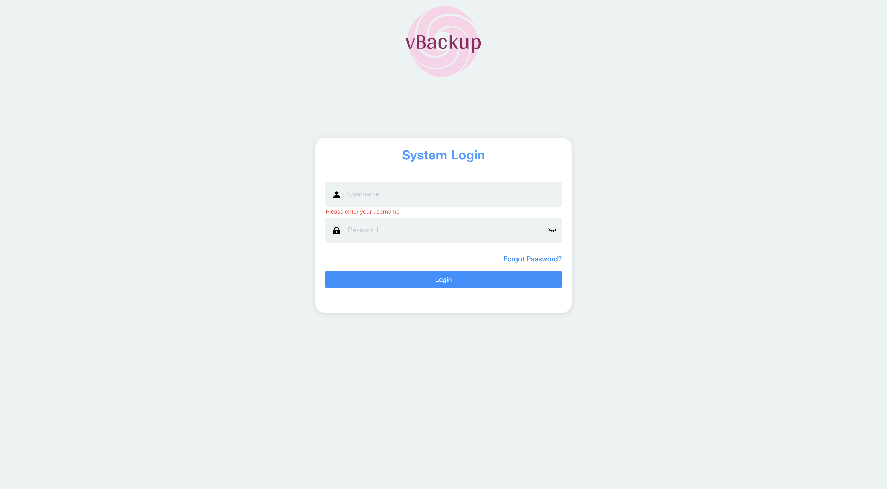

### Dashboard Page

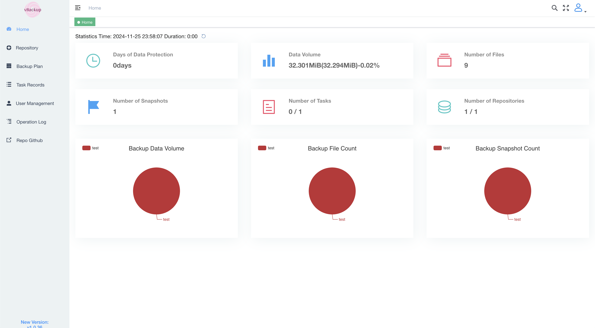

### Repository Page

#### Repository List

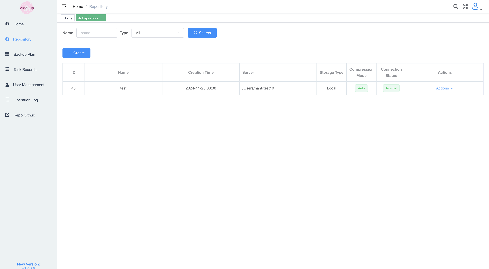

#### Create Repository

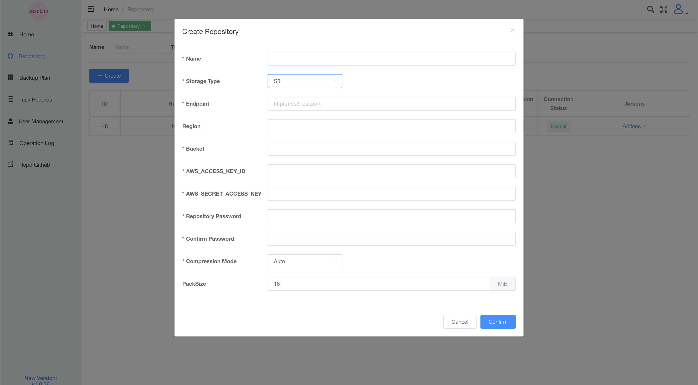

### Policy Page

#### Policy List

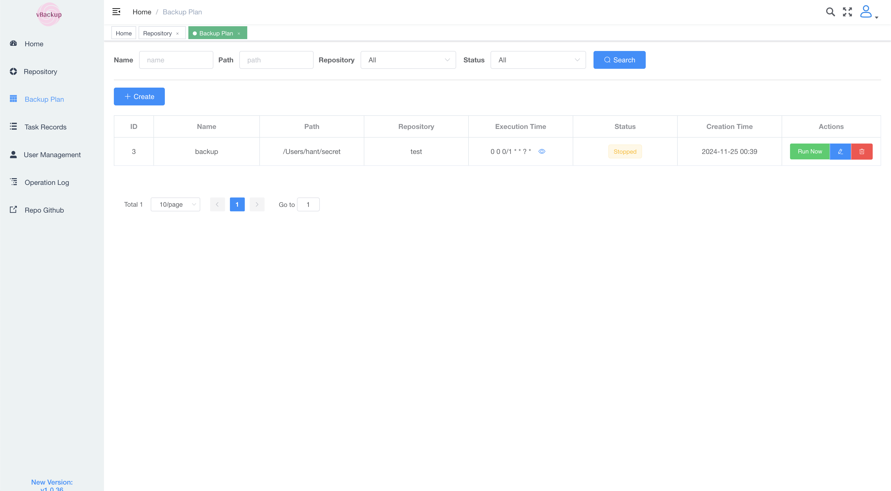

#### Create Policy

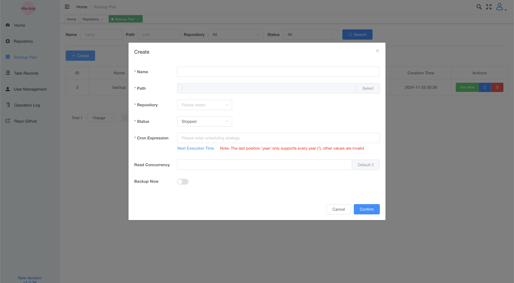

### Record Page

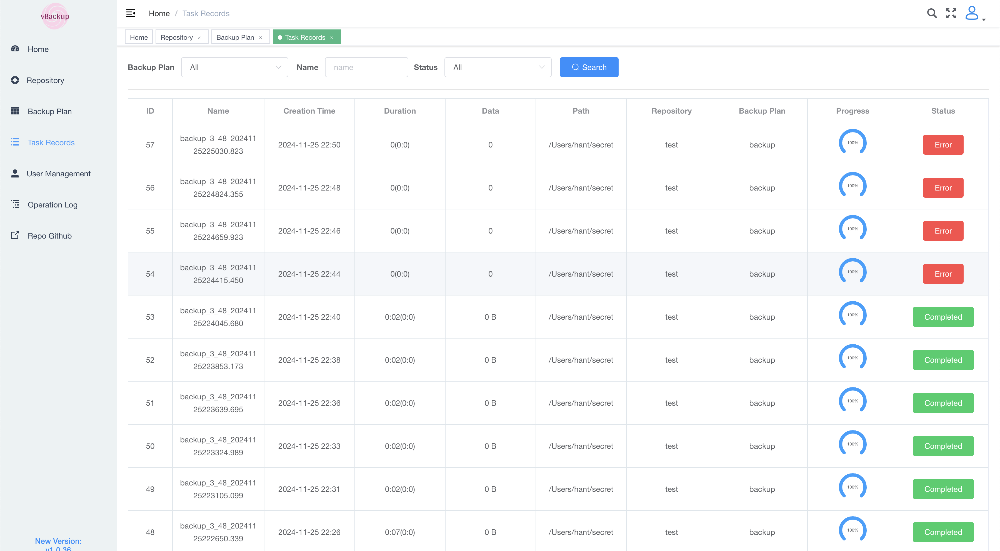

### User Management Page

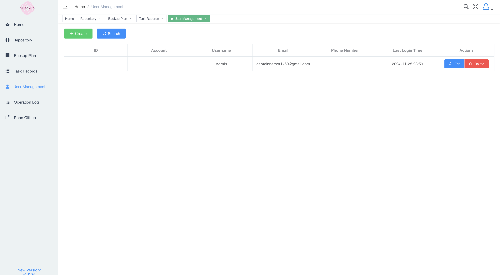

### Create User

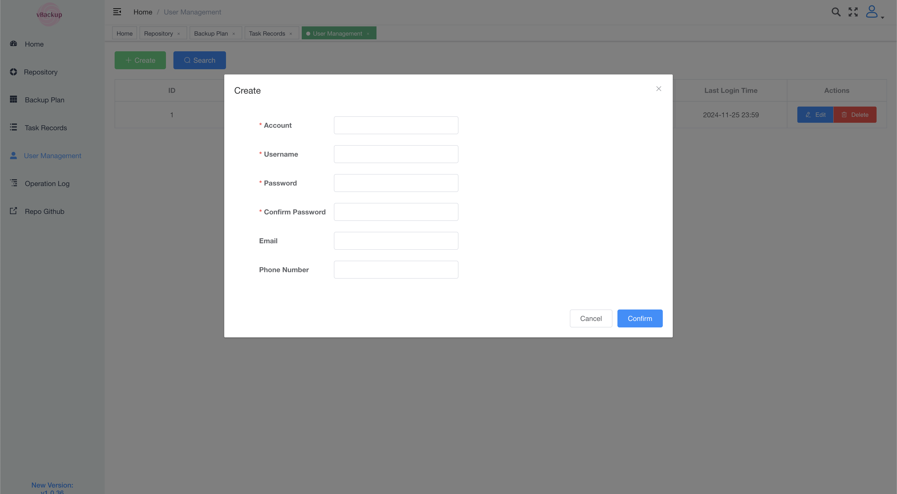

### Setting Page

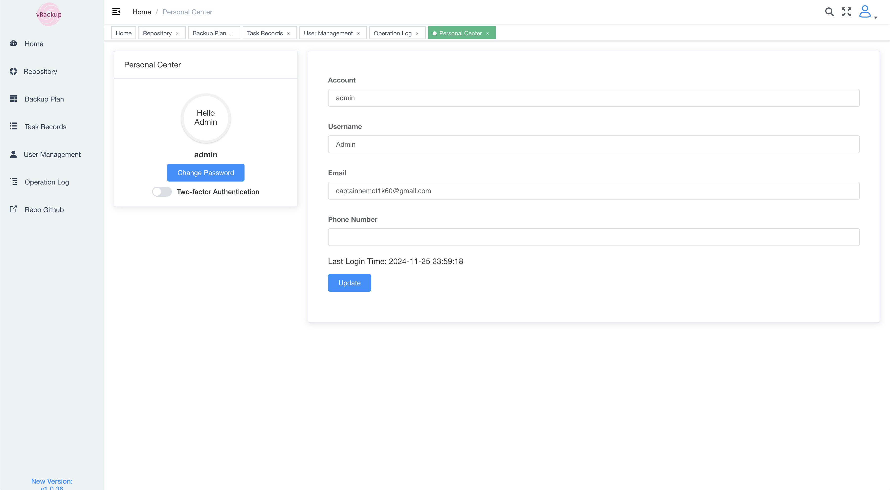

### MFA Page

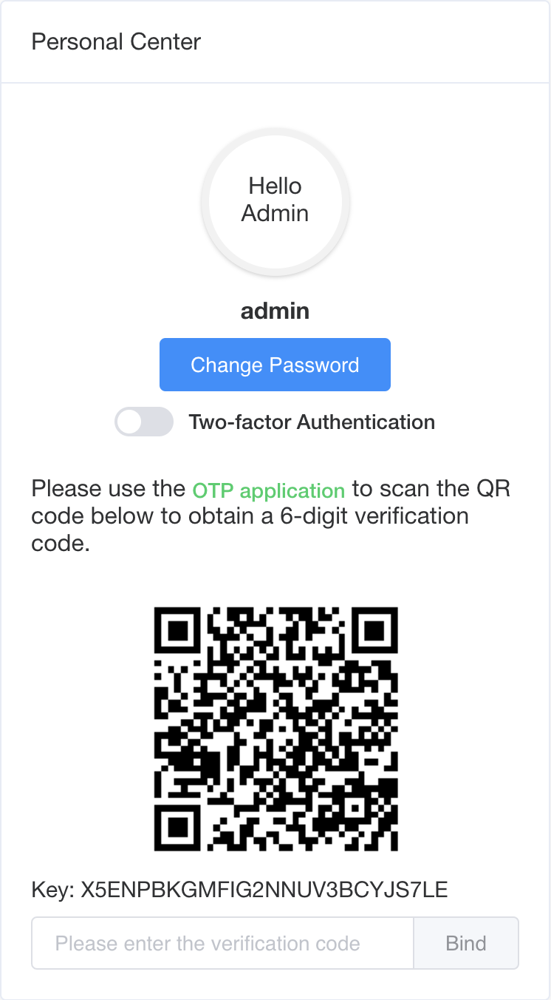

## Quick Start

## Documentation

